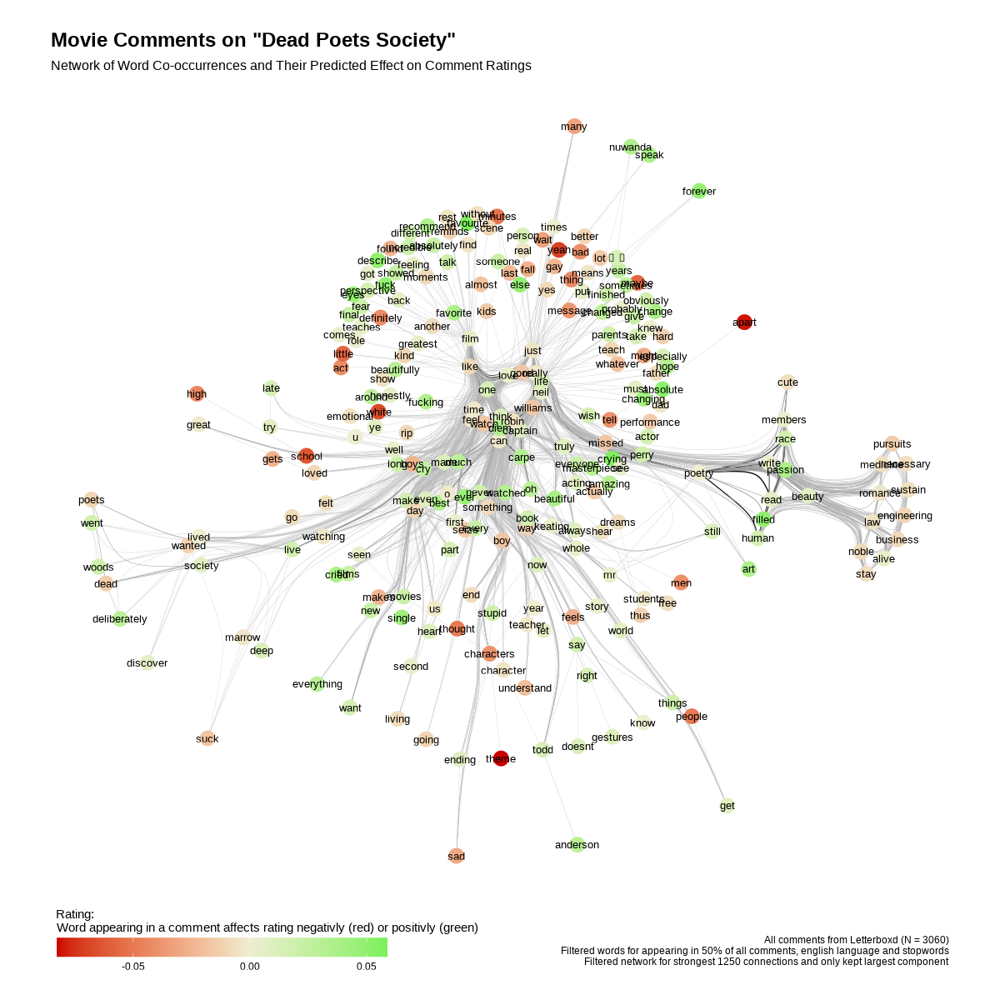

# What 3,060 Letterboxd Comments Reveal About *Dead Poets Society*

## The Data

I scraped 3,060 user comments (and their star ratings) for *Dead Poets Society* from Letterboxd, the social platform for film lovers. After filtering for English-language comments and removing common stopwords, I was left with a rich vocabulary of the words people actually use when talking about this film.

## The Method

The analysis has two layers:

**Word co-occurrence network.** Using the `quanteda` text-analysis package in R, I built a Feature Co-occurrence Matrix — essentially counting how often words appear together in the same comment. The 1,250 strongest connections were kept and visualised as a network graph, where linked words tend to show up in the same reviews.

**Rating prediction.** I then fitted a Ridge regression model (`glmnet`) to predict a comment's star rating from the words it contains. Each word gets a coefficient: positive means the word is associated with *higher* ratings (shown in **green**), negative means *lower* ratings (**red**). Neutral words sit in a pale yellow middle ground.

## What Stands Out

**The emotional core is positive.** The densest part of the network — words like *beautiful*, *amazing*, *masterpiece*, *poetry*, *passion*, *dreams* — glows green. People who reach for these words tend to rate the film highly. This cluster captures the movie's central themes of seizing the day and the beauty of self-expression.

**Character names anchor the conversation.** *Neil*, *Todd*, *Anderson*, *Keating*, and *Mr. Williams* all sit near the centre, tightly connected to everything else — they're the vocabulary everyone shares regardless of opinion.

**Negative words live on the edges.** Red-tinted nodes like *sad*, *apart*, *shame*, and *favourite* (which, interestingly, co-occurs with more critical commentary) drift toward the periphery. The word *stupid* also appears in an orange hue, often showing up in comments that are more mixed or critical.

**A "why it matters" cluster on the right.** Words like *beauty*, *passion*, *human*, *write*, *read*, *art*, *engineering*, *medicine*, *law*, *business* form a distinctive green cluster — reflecting comments that discuss the film's central tension between pursuing the arts and conforming to practical career expectations.

## Takeaway

Most people *love* this film. The network is overwhelmingly green, and the most connected, central vocabulary is deeply positive and emotional. Critical voices exist but are quieter and more scattered — the few red nodes at the margins of an otherwise glowing map of admiration.

---

*Built in R with quanteda, tidygraph, ggraph, graphlayouts, and glmnet.*
